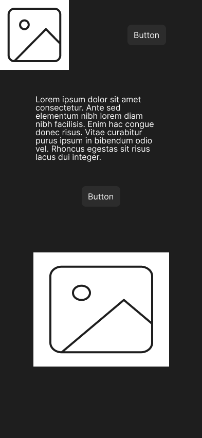
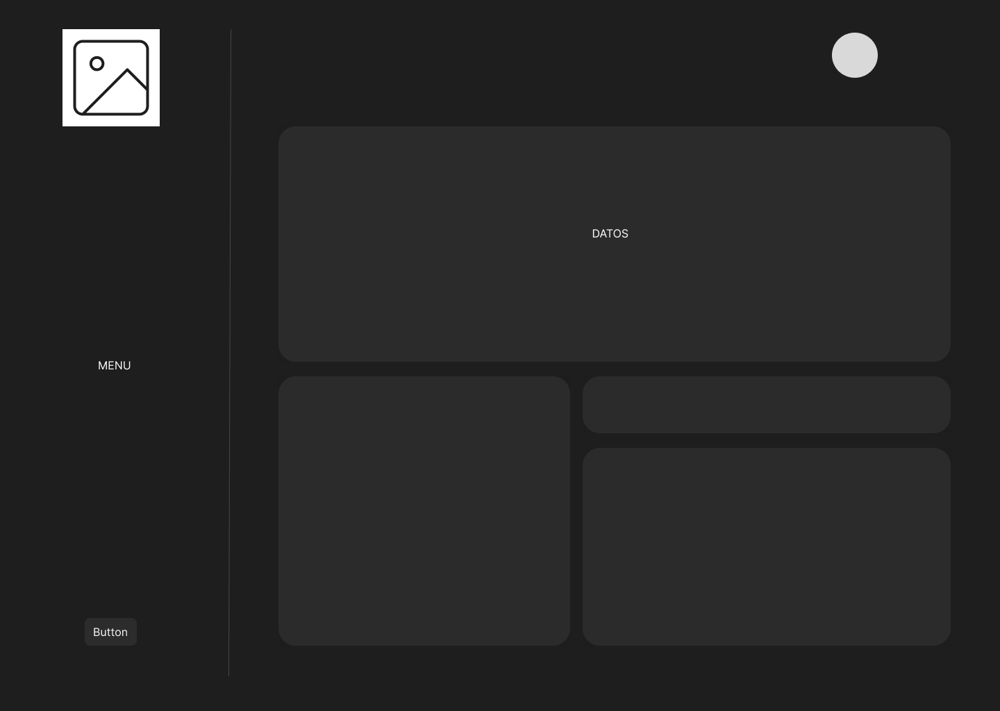
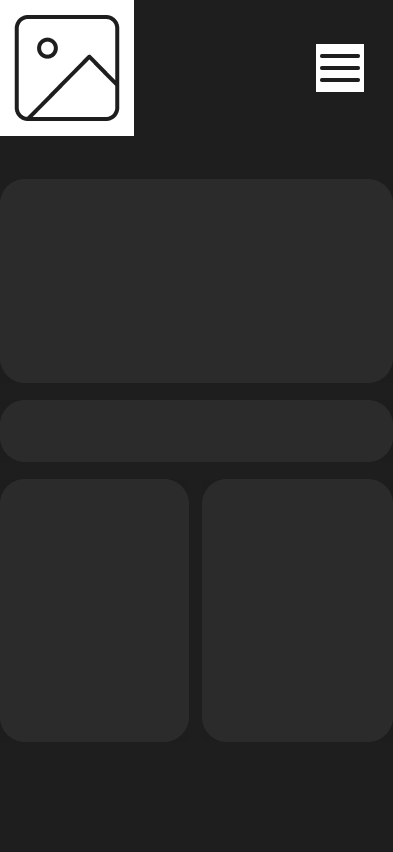

# Por qué del proyecto.

La mayoría de los softwares de generación de facturas son complicados, extensos, poco intuitivos y además vienen cargados de muchas otras funcionalidades que no le interesan a la pequeña y mediana empresa. Muchas de ellas siguen utilizando el papel para realizar este trabajo que puede realizarse de manera muy sencilla con el software correcto.

Este proyecto irá destinado al desarrollo de una web de gestión y generación de facturas de una manera sencilla e intuitiva.

# Descripción del proyecto.

1- Creación de una web de gestión y generación de facturas.

2- Facilitar a la empresa que pueda realizar y mandar facturas con pocos clics.

3- Tener una base de datos con clientes para que sea aún más rápido.

# Wireframes.

## Landing Wireframe

--- -

## M Landing Wireframe

--- -

## Dashboard Wireframe

--- - 

## M Dashboard Wireframe

--- -